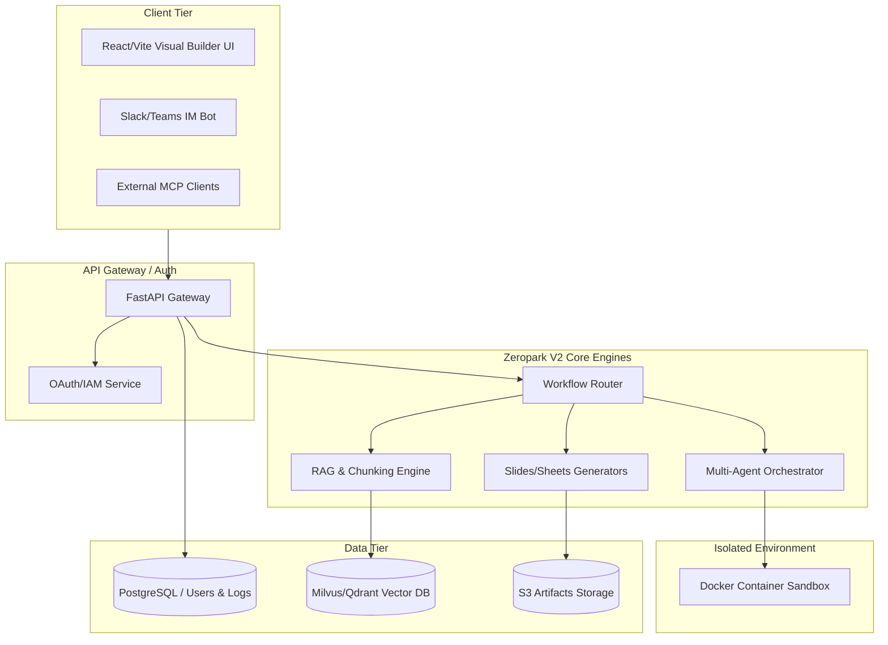

# Zeropark V2 Architecture

## 1. 개요
Zeropark V2는 모노레포의 장점을 유지하면서도, 엔터프라이즈 환경에서의 보안 및 스케일 아웃을 위해 마이크로서비스(MSA) 형태의 컨테이너 기반 아키텍처로 진화합니다.

## 2. 시스템 구성도

## 3. 핵심 변경 사항 (V1 -> V2)

### 3.1. 인증과 권한(DB) 계층 추가
- 기존에는 상태 없는(Stateless) API의 나열이었다면, V2부터는 PostgreSQL 등 RDBMS를 도입하여 **유저 상태(Session), 워크스페이스 상태, 권한, 토큰 소비량(Observability)**을 기록합니다.

### 3.2. VectorDB 외주화
- 로컬 인메모리로 처리하던 벡터 스토어를, 상용화 스케일에 맞게 **Milvus 또는 Qdrant** 같은 독립 컨테이너 DB로 전환하여 수십만 건의 사내 문서 임베딩을 버틸 수 있도록 설계합니다.

### 3.3. Sandbox 네트워크 차단 (Docker)
- 에이전트가 실행하는 `python_exec` 코드는 오직 호스트 네트워크와 격리된 Docker 컨테이너 안에서만 실행되며, 완료 후 컨테이너는 폐기됩니다(Ephemeral).
