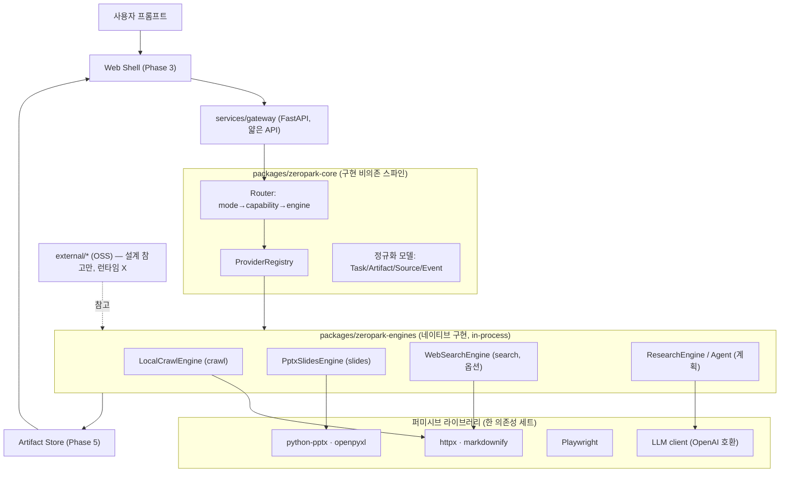

# 시스템 아키텍처 (Zeropark — 네이티브 단일 프레임워크)

> 핵심: OSS 엔진을 **API로 호출하거나 서비스로 띄우지 않는다.** 각 OSS는 **설계 참고**일 뿐,
> 기능은 가벼운 퍼미시브 라이브러리로 **프레임워크 안에 네이티브 구현**한다. 결과물은 한 리포,
> 하나의 판매 가능한 프레임워크.

## 1. 핵심 원칙

1. **단일 아티팩트.** 클라이언트는 5개 서비스를 띄울 필요 없이 우리 프레임워크 하나만 설치.
2. **코어는 구현을 모른다.** 코어는 Capability만 알고, 그것을 어떤 엔진이 구현하는지는 registry로 주입.
3. **엔진=네이티브 구현.** 각 엔진은 in-process에서 라이브러리로 기능을 수행(HTTP 호출 아님).
4. **OSS=참고만.** `external/`는 설계 참고용. 런타임 의존·import 없음. (라이선스: [dependency-isolation.md](dependency-isolation.md))
5. **덧대기 안전.** 엔진/기능 추가는 클래스 1개 + 등록 1줄. 기존 코드 무수정.

## 2. 레이어 구조

## 3. 컴포넌트 책임

| 컴포넌트 | 위치 | 책임 |
|---|---|---|
| Capability | core | 제품 어휘(search/crawl/research/slides/…). 구현과 독립 |
| Provider (ABC) | core | 엔진 인터페이스. `cap_<capability>` 디스패치 |
| ProviderRegistry | core | 설정된 네이티브 엔진의 런타임 색인 |
| Router | core | mode→capability 파이프라인 + capability→engine 선택 |
| 정규화 모델 | core | Task/Artifact/SourceRef/RunEvent/TaskResult |
| NativeEngine | engines | in-process 구현 베이스(+`reference` 표기) |
| 엔진들 | engines | crawl/slides/search/… 네이티브 구현 |
| Gateway | services/gateway | 얇은 FastAPI. registry+router에 위임 |

## 4. 확장 규칙 (스파게티 방지)

- **새 기능(capability) 추가:** core에 Capability 추가 → 엔진에 `cap_<x>` 메서드 → router ModePlan. 중앙 분기문 없음.
- **새 엔진/구현 추가:** `zeropark_engines`에 `NativeEngine` 서브클래스 + `loader.build_registry`에 등록 1줄.
- **구현 교체:** 같은 capability에 다른 엔진 등록 + `capability_preferences` 설정. 코드 무수정.
- **클라이언트별 배포:** 같은 코드 + 다른 `ZeroparkSettings`. fork 아님.

## 5. 현재 구현 상태

| capability | 상태 | 구현/계획 |
|---|---|---|
| crawl | ✅ 구현 | httpx + markdownify (정적 HTML). Playwright 변형 계획 |
| slides | ✅ 구현 | python-pptx (outline→pptx) |
| search | ◻ 옵션 | 커머디티 검색 API 클라이언트(설정 시 등록) |
| research / super_agent | ⏳ 계획 | search+crawl+LLM 자체 경량 오케스트레이터 |
| sheets | ⏳ 계획 | openpyxl |
| browse | ⏳ 계획 | Playwright + LLM |
| workflow | ⏳ 계획 | 자체 그래프(또는 LangGraph 참고) |
