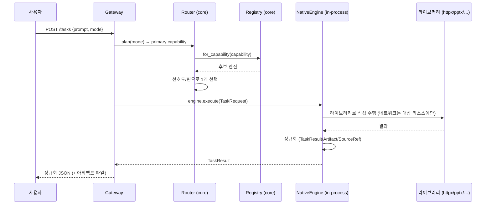
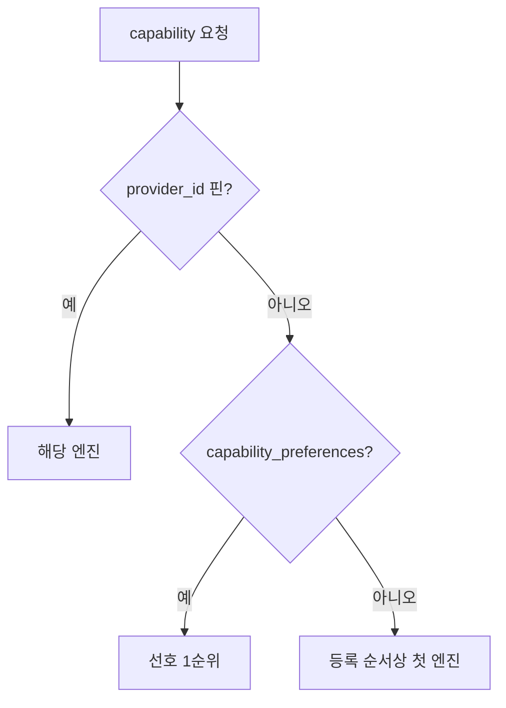
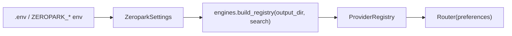

# 데이터 흐름 (Zeropark — 네이티브)

## 1. 프롬프트 → 산출물 (외부 호출 없음)

> 엔진 간 HTTP 호출이 없다. 네트워크는 crawl 대상 URL이나 LLM/검색 API 같은 "외부 리소스"에만 발생.

## 2. mode → capability 파이프라인

현재 `DEFAULT_MODES`: super_agent, research, slides, sheets, dashboard, browser, workflow.
파이프라인 중 등록된 엔진이 없는 capability는 에러가 아니라 `missing`으로 보고(부분 기능 배포 허용).
예) 현재 research 모드 → crawl만 등록되어 있으면 search·research는 missing.

## 3. capability → engine 선택

## 4. 설정 주입 (클라이언트별 배포)

기본 설치는 crawl·slides가 무설정으로 동작. search는 백엔드 설정 시 등록. LLM 설정 시 research/agent 활성(계획).
