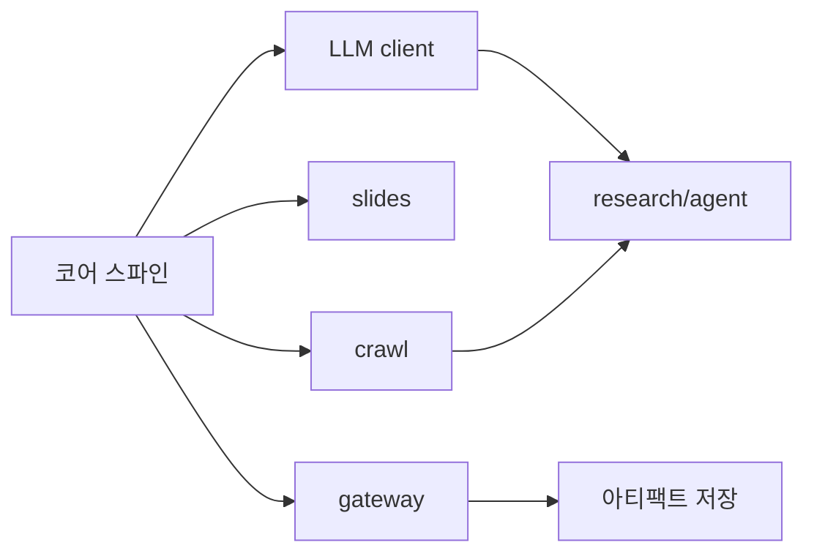

# WBS (Zeropark)

## 마일스톤 (Phase)

| Phase | 마일스톤 | 완료 기준 | 상태 |
|---|---|---|---|
| 0 | 리포 기반·문서 | 워크스페이스, 문서 표준 | ✅ |
| 1 | OSS 참고 검증 | 각 OSS 기능·구조 파악 | ✅ |
| 2 | 코어 스파인 + 네이티브 엔진 | core + crawl/slides 구현 + gateway + 테스트 | 🔵 |
| 3 | Web Shell | 프롬프트→진행→아티팩트 UI | ⏳ |
| 4 | capability 확장 | research/agent/browse/sheets/workflow 네이티브 | ⏳ |
| 5 | 저장·공유 | 아티팩트 영속·버전·공유 | ⏳ |
| 6 | 상용화 | 보안·라이선스·평가·패키징 | ⏳ |

## 작업 분해 (현재 Phase 2)

| WBS | 작업 | 산출물 | 상태 |
|---|---|---|---|
| W-01 | 코어 스파인 | capabilities/models/provider/registry/router/config | ✅ |
| W-02 | crawl 엔진 | LocalCrawlEngine | ✅ |
| W-03 | slides 엔진 | PptxSlidesEngine | ✅ |
| W-04 | gateway | FastAPI 위임 계층 | ✅ |
| W-05 | LLM client 추상 | provider-agnostic LLMClient | ⏳ |
| W-06 | research/agent 엔진 | 경량 오케스트레이터 | ⏳ |
| W-07 | browse/sheets 엔진 | Playwright/openpyxl | ⏳ |
| W-08 | 아티팩트 저장 | store 인터페이스 | ⏳ |

## 의존성

## 5. 로드맵 백로그 (capability-roadmap.md 반영)

| WBS | 작업 | Phase | 비고 |
|---|---|---|---|
| W-09 | LLM client 추상(멀티프로바이더) | 2 | research/slides/browse 선행 |
| W-10 | Tool/Skill 레지스트리 | 2 | 에이전트 도구 |
| W-11 | Memory + Vector store | 2 | RAG/리서치 |
| W-12 | search v1(멀티 백엔드) | 2 | Brave/Bing/Tavily/Arxiv |
| W-13 | research v1(인용 리포트) | 3 | search+crawl+LLM |
| W-14 | crawl v2(JS·추출·딥크롤) | 3 | Playwright·fit-markdown |
| W-15 | browse v1 | 3 | Playwright 에이전트 |
| W-16 | SSE 스트리밍 + Web Shell | 3 | RunEvent |
| W-17 | super_agent(샌드박스) | 4 | 플래너+서브에이전트 |
| W-18 | slides v2(LLM·템플릿·차트·PDF) | 4 | Presenton급 |
| W-19 | sheets v1 / dashboard v1 | 4 | openpyxl·차트 |
| W-20 | workflow/RAG v1 | 4 | Dify급(독립 구현) |
| W-21 | artifact store·observability | 5 | 영속·비용·트레이스 |
| W-22 | 보안·라이선스·평가·패키징·MCP 노출 | 6 | 상용화 |
