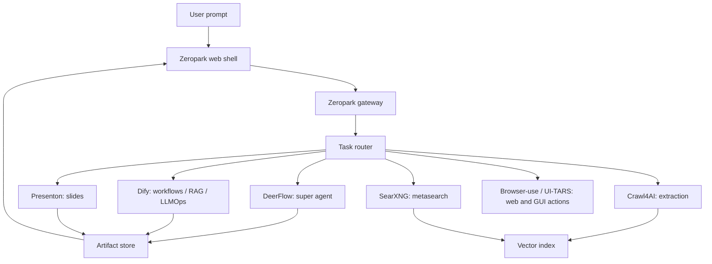

# Genspark-Like OSS Build Plan

Generated: 2026-06-08

## Objective

Build an OSS-first AI workspace inspired by the public Genspark product surface: one prompt starts research, agent execution, data analysis, slides, sheets, dashboards, generated pages, and shareable artifacts.

We should not copy Genspark's name, visual identity, private prompts, proprietary models, or exact UI. We should build an original product that uses the same broad category primitives.

## Public Feature Surface To Match

Based on current public pages and docs, the Genspark surface includes:

- A Super Agent that plans and acts across many tools, models, and specialized agents.
- Research and content generation from a single prompt.
- AI Slides with research, design, charts, fact checking, and PPTX/PDF/Google Slides export.
- AI Sheets that builds schemas, collects live data, writes formulas, creates charts, and exports `.xlsx`.
- Live dashboards from natural-language data questions.
- Multi-artifact workspace behavior: docs, sheets, slides, pages, files, and shared links.

Sources:

- https://www.genspark.ai/helpcenter/super-agent
- https://www.genspark.ai/helpcenter/ai-slides
- https://www.genspark.ai/tools/ai-spreadsheet-generator
- https://www.genspark.ai/

## Architecture Decision

Use DeerFlow as the core execution harness, Dify as the production workflow/RAG/LLMOps layer, and dedicated OSS services for artifacts.

## OSS Components

| Component | Role | Decision |
| --- | --- | --- |
| ByteDance DeerFlow | Long-horizon super-agent harness with sub-agents, sandboxes, memory, skills | Adopt as core |
| Dify | Production workflow/RAG/model/observability platform | Adopt as workflow backend, watch license restrictions |
| OpenManus | Lightweight general AI agent framework | Keep as fallback/reference |
| Presenton | Open-source AI presentation generator and API | Adopt for slides |
| Crawl4AI | LLM-friendly crawler and structured extraction | Adopt for crawl/extract |
| SearXNG | Self-hosted metasearch | Use behind internal service boundary; review AGPL obligations |
| Browser-use | Browser task automation | Adopt for browser actions |
| UI-TARS Desktop / Agent TARS | Multimodal GUI/computer-use agent stack | Optional phase 2 experiment |
| Coze Studio | All-in-one visual agent/workflow platform | Optional alternative to Dify for visual builder |

## Build Phases

### Phase 0: Repository Foundation

Status: started in this repo.

Deliverables:

- OSS source map and license notes.
- Fetch script for external OSS repos.
- FastAPI gateway scaffold.
- Service health script.
- Local runbook.

Exit criteria:

- `python -m unittest discover -s services/gateway/tests` passes.
- `python -m compileall services/gateway/src` passes.
- Gateway can return `/health`, `/services`, and `/route`.

### Phase 1: OSS Smoke Test Matrix

Goal: prove each external system can run locally before building product UI.

Tasks:

- Fetch core repos into `external/`.
- Run DeerFlow and confirm one research task completes.
- Run Dify and export/import one workflow DSL.
- Run Presenton and generate one PPTX from a prompt.
- Run SearXNG and confirm JSON search.
- Run Crawl4AI and confirm URL to markdown extraction.
- Run browser-use and complete one simple browser action.

Exit criteria:

- `docs/runbooks/smoke-test-results.md` records exact commands, ports, screenshots or outputs, and blockers.

### Phase 2: Gateway Integration

Goal: make Zeropark the stable product API above unstable OSS internals.

Tasks:

- Implement task creation, streaming status, cancellation, and artifact registration.
- Add adapters for DeerFlow, Dify, Presenton, SearXNG, Crawl4AI, and browser-use.
- Normalize outputs into `artifact`, `source`, `event`, and `run_log` records.
- Add auth boundary and per-provider API key handling.
- Add observability fields: model, cost estimate, latency, retry count, source count.

Exit criteria:

- A single API can run research, slides, and workflow tasks through configured OSS services.

### Phase 3: Workspace Web Shell

Goal: build the first real user experience.

Tasks:

- Next.js app with a prompt box, mode picker, source panel, run timeline, artifacts panel, and export/download controls.
- Progress streaming from gateway.
- Artifact viewer for report, deck, sheet, generated page, and file outputs.
- Connection settings for model providers and OSS service URLs.

Exit criteria:

- User can enter a prompt, watch a task run, open outputs, and download at least one artifact.

### Phase 4: Agent Skills And Product Modes

Goal: create opinionated Zeropark workflows on top of the OSS engines.

Tasks:

- Deep research skill: source discovery, crawl, citation extraction, report writing.
- Slides skill: brief, outline, data/charts, deck generation, fact-check pass.
- Sheets skill: schema design, data collection, formula generation, charting, `.xlsx` export.
- Dashboard skill: ingest data, generate charts, create live report page.
- Web page skill: generate and publish static pages.

Exit criteria:

- Each mode has a reusable task recipe and evaluation checklist.

### Phase 5: Storage, Sharing, And Collaboration

Goal: turn generated files into workspace objects.

Tasks:

- Postgres/Supabase schema for projects, runs, messages, artifacts, sources, credentials, and shares.
- Object storage via S3-compatible storage or Supabase Storage.
- Public share links with revoke/expire controls.
- Version history for generated artifacts.

Exit criteria:

- Outputs persist beyond one run and can be shared safely.

### Phase 6: Quality, Safety, And Commercial Readiness

Tasks:

- License review for Dify, SearXNG, Crawl4AI attribution, and any AGPL network obligations.
- Prompt-injection protections for browsing/crawling and file ingestion.
- SSRF restrictions for URL fetchers and crawler proxy settings.
- Sandbox isolation policy for DeerFlow/browser-use/computer-use tasks.
- Regression evals for research quality, citation validity, deck quality, and artifact exports.
- Cost controls by model and task type.

Exit criteria:

- Security review complete before any public launch.

## Parallel Workstreams

- Workstream A: DeerFlow/Dify/Presenton smoke tests.
- Workstream B: Gateway adapters and normalized artifact model.
- Workstream C: Web shell design and artifact viewers.
- Workstream D: Security, license, and eval harness.

Phase 1 can run A and D in parallel. Phase 2 and Phase 3 can overlap once task/event contracts are stable.

## Key Risks

- Dify has additional license conditions around multi-tenant service usage and frontend branding.
- SearXNG is AGPL-3.0; if modified or exposed as a network service, source obligations matter.
- Crawl4AI has an attribution requirement in addition to Apache-2.0 text.
- Web automation can violate target website terms; implement allowlists, rate limits, and audit logs.
- "Same as Genspark" cannot mean copying protected UI, names, assets, or private implementation.
- Agent outputs need source verification; citation hallucination is a product risk.

## Immediate Next Steps

1. Run `.\scripts\fetch-oss.ps1 -Core`.
2. Smoke-test DeerFlow, Dify, Presenton, SearXNG, Crawl4AI, and browser-use.
3. Fill `docs/runbooks/smoke-test-results.md`.
4. Implement real adapters in `services/gateway`.
5. Start the web shell after adapter contracts are stable.

